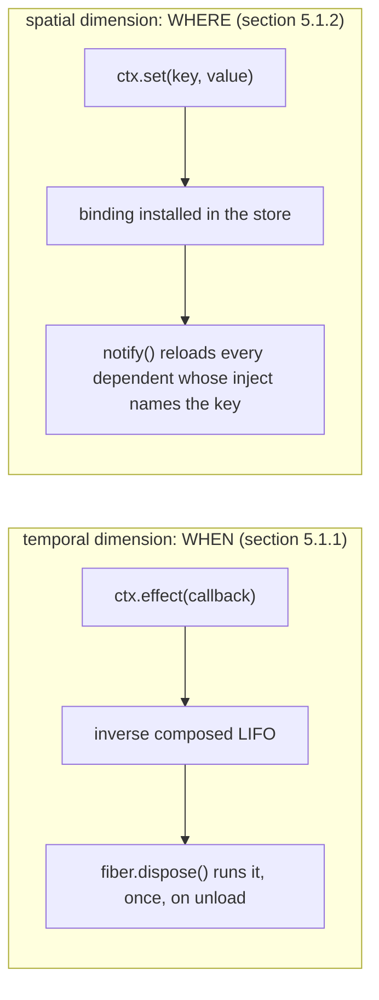
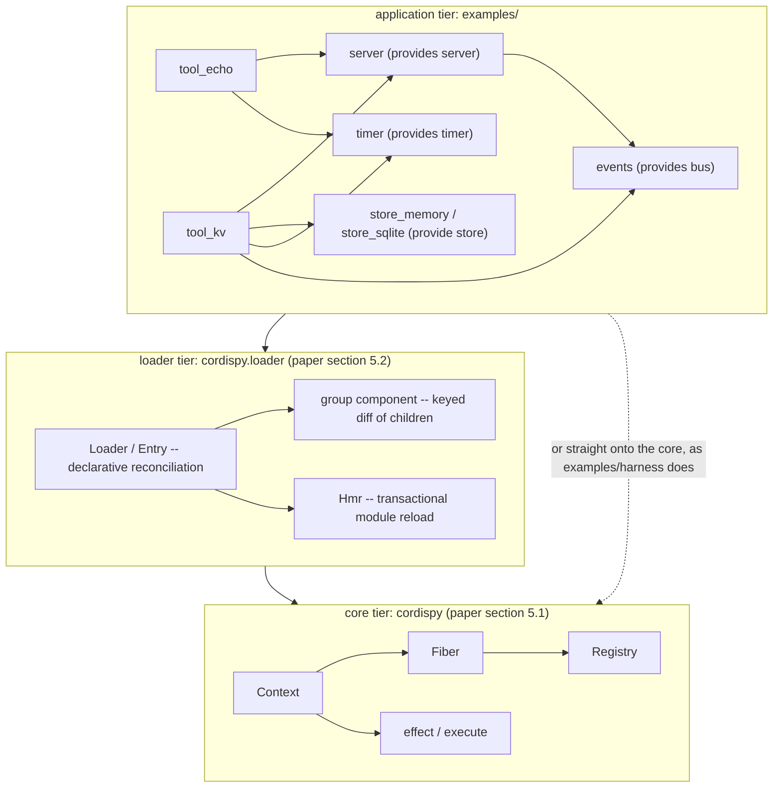

# cordispy

A Python realization of the runtime described in *A Programming Paradigm for Spatiotemporal
Composability* (Shi, Zhang, Cui -- DeepSeek-AI / Peking University). The paper's reference
implementation is the TypeScript project [Cordis](https://github.com/cordiverse/cordis); the paper
itself is at [github.com/cordiverse/paper](https://github.com/cordiverse/paper). This port targets
Python 3.11+ and `asyncio`, follows the paper's algorithms directly, and is documented against the
paper's section numbers throughout, so a reader of either source can cross-navigate to the other.

```sh
pip install cordispy      # or: uv add cordispy
```

```python
import cordispy
```

Distribution and import package are both `cordispy`. The plain name `cordis` is taken on PyPI by an
unrelated 0.0.0 placeholder published in 2024, which ships a top-level `cordis` package of its own -- do
not install that one.

## The problem

Uninstalling a VS Code extension does not uninstall it. VS Code runs every extension in one shared
host process, and once an extension's `activate` function has run there is no way to unload just its
code -- disabling or removing it requires restarting the whole host, taking every other loaded
extension down with it. Among the top 100 extensions by install count, 87 contain executable code and
therefore force that restart on removal (paper section 1.2.1). The `deactivate` hook VS Code does
provide only runs at process shutdown, and because it is written separately from `activate` it can
only clean up what its author remembered to mirror there.

The same install base shows the second half of the problem. VS Code lets an extension declare a
dependency on another extension, but almost nothing does: only 7 of those top 100 extensions declare
a dependency on a non-built-in extension (paper section 1.2.1, same source). Extensions default to
depending on nothing because the platform gives them no structural way to depend on something safely --
the mechanism that exists hands back an untyped value with no contract and no notion of "this went
away."

Both gaps have the same shape: nothing in the platform tracks *what a piece of code did to the running
system*, so nothing can undo it precisely, and nothing tracks *what it needs from the rest of the
system*, so nothing can react when that need stops being met. This runtime is built around closing
both gaps at the level of a single Python object -- a `Context` -- rather than at the level of a whole
process.

## Two dimensions

Every component in this runtime is described along two independent axes, matched to two paper
sections:

- **Temporal (paper section 5.1.1, Algorithm 1).** A component never mutates anything directly; it
  performs an *effect* through `ctx.effect(callback)`, and the callback hands back the inverse that
  undoes it. Unloading a component runs every inverse it accumulated, most-recent-first, so the system
  returns to exactly the state it was in before the component was composed in.
- **Spatial (paper section 5.1.2, Algorithms 2, 3 and 6).** A component declares what it needs
  (`inject`) and what it offers (`ctx.set`, after declaring `provide`). It never looks anything up by
  hand: the runtime activates it the moment its declared dependencies are satisfied, deactivates it the
  moment they stop being satisfied, and keeps a withdrawn dependency readable for exactly as long as
  the component's own teardown needs to see it.

The diagram below is not the runtime's class diagram; it is the shortest path from a paper mechanism
to the call that realizes it. Read left to right: a temporal fact about a component (an effect
happened, and it has an inverse) turns into a runtime call on the left, and a spatial fact (a value is
published, or needed) turns into one on the right.



What to take from it: the two dimensions share one primitive. `ctx.set` is itself implemented as a
`ctx.effect` call (its inverse withdraws the binding), and `ctx.use` -- instantiating a component -- is
also a `ctx.effect` call whose inverse retires the fiber. Nothing in this runtime mutates the world
outside that one tracked operation, which is what makes "unload" a well-defined, total operation
instead of a best-effort convention. `docs/paradigm.md` develops both dimensions in full.

## The three tiers

The code is layered the way the paper lays out Section 5: a core library that implements the effect
and coeffect systems directly, a declarative loader built on top of it without touching it, and
application code -- including the demo used throughout this repository's docs -- built on both. Read
the diagram bottom to top: everything above a tier is built using only that tier's public calls, never
its internals.



What to take from it: `examples/harness/`, the demo application used by `docs/benefits.md` and
`docs/plugin-authoring.md`, is composed straight on the core tier with `ctx.use` -- it does not go
through the loader at all. `examples/run_loader.py` is the one example that exercises the loader tier,
reading a declarative YAML/JSON document instead of calling `ctx.use` by hand. Both are legitimate: the
loader is an optional convenience over the core, never a requirement of it.

## Quickstart

This runs as shown -- copy it into a file and run it with `uv run python`, or paste it into `python -m
asyncio`.

```python
import asyncio
from cordispy import Context, plugin


@plugin(name="store", provide=["store"])
def store(ctx, config):
    ctx.set("store", {})


@plugin(name="counter", inject=["store"])
def counter(ctx, config):
    ctx.store["hits"] = 0
    return lambda: ctx.store.pop("hits", None)


async def main():
    root = Context()
    provider = root.use(store)
    consumer = root.use(counter)

    # One activation can start another, so wait for the whole runtime to
    # settle rather than for one fiber.
    await root.registry.settle()
    assert consumer.state.name == "ACTIVE"
    assert root.get("store") == {"hits": 0}

    await provider.retire()  # the consumer deactivates by itself
    assert consumer.state.name == "INACTIVE"
    assert root.get("store") is None


asyncio.run(main())
```

Nothing here names an order. `counter` could have been composed before `store` -- it would simply have
stayed `PENDING` until `store` arrived. Retiring the provider does not touch `counter` directly; it
recomputes its own target, finds `store` gone, and unloads itself. `docs/paradigm.md` and
`docs/architecture.md` walk through exactly how.

## Work from a checkout

`pip install cordispy` is enough to use the runtime. The examples, the guided demos and the test suite
below live in the repository rather than the wheel, so clone it to run them. From the repo root:

```sh
uv venv
uv sync --all-extras
uv run pytest -q                      # 139 passed
uv run python examples/run_benefit.py --scenario all
uv run ruff check .
uv run mypy src/cordispy
```

The only runtime dependency is `pyyaml`, used by the loader for `.yaml` configuration files; a `.json`
configuration loads through the standard library alone, so the loader works even where PyYAML is not
installed.

## The examples

| File | What it shows |
| --- | --- |
| `examples/run_effects.py` | The five accepted effect-callback forms, LIFO recovery, the guard halting an in-flight iterator at a step boundary, and the built-in `timer`/`bus` plugins leaving zero residue. |
| `examples/run_services.py` | Activation independent of composition order, the ordering guarantee (a withdrawn dependency stays readable through the dependent's own teardown), the two property-access rejections, and realm isolation. |
| `examples/run_hotswap.py` | Swapping the `store` provider under a running consumer: the consumer deactivates, the old connection closes, the consumer reactivates against the new binding, and requests keep being served throughout. |
| `examples/run_benefit.py` | The centerpiece: the same application built on this runtime and on a conventional plugin registry, with the residue after unload, a hot-swap, a late-arriving dependency, and a mid-load failure measured on both. See `docs/benefits.md`. |
| `examples/run_calculator.py` | A calculator whose every arithmetic operation is a plugin. Removing one, composing a derived one before its dependencies, and one that fails mid-load -- measured by whether the calculator still *offers* operations it can no longer perform. |
| `examples/run_loader.py` | The declarative loader reconciling four revisions of a YAML/JSON configuration incrementally, then hot-replacing a plugin module on disk -- once successfully, once into a transactional rollback. |

Run any of them with `--help` for its options; every CLI in this repository uses `argparse` with named
flags only.

### Guided demos

[`tests/UAT/`](tests/UAT/README.md) pairs each example with a copy-paste walkthrough guide and a script
that runs the guide's own commands and asserts every expectation it states. Use them to demo the runtime
to someone, or to check a change by hand:

```sh
./tests/UAT/benefit.sh --auto   # the centerpiece comparison, asserted step by step
./tests/UAT/run-all.sh          # all five guides, in order
```

### The demo pages

Two self-contained pages run the comparisons as interactive models, for showing the paradigm to someone
without a Python environment in front of them. Open either straight from a clone in any browser -- they need
no server and load nothing from the network.

[`docs/demo.html`](docs/demo.html) is the residue comparison: retire a component and count what survives.
[`docs/demo-calculator.html`](docs/demo-calculator.html) is the calculator -- toggle arithmetic operations
as plugins, type an expression, and watch which of the two keeps advertising an operation it can no longer
perform.

Each has a ten-step guided walkthrough shaped like the matching `tests/UAT/*.sh` guide -- every step states
why it exists and what to expect, applies one action to *both* runtimes, and asserts the outcome against the
live model -- plus a free-play mode for driving the two side by side yourself. The numbers they report are
the ones the demos print: 13 resources acquired on both sides against 0 residue and 9, and a calculator that
goes on offering `%` after the division its remainder is defined in terms of has been removed.

## Documentation

- [`docs/paradigm.md`](docs/paradigm.md) -- the theory-to-runtime mapping: effects, coeffects, and the
  five callback forms `ctx.effect` accepts.
- [`docs/architecture.md`](docs/architecture.md) -- internals: the effect engine, the fiber state
  machine and inertial chaining, two-layer coeffect resolution, and a provider hot-swap traced step by
  step.
- [`docs/plugin-authoring.md`](docs/plugin-authoring.md) -- how to write a component: `@plugin`,
  `inject`/`provide`, `ctx.key` vs `ctx.optional` vs `ctx.get`, the built-in `timer` and `bus` services,
  and the demo harness's dependency topology.
- [`docs/benefits.md`](docs/benefits.md) -- the measured naive-vs-cordis comparison, with the literal
  output of `run_benefit.py`.
- [`docs/source-review.md`](docs/source-review.md) -- the vocabulary map against the shipped
  TypeScript, and seven defects the source review found and this port fixes, each with a file:line.
- [`docs/limitations.md`](docs/limitations.md) -- what this port deliberately does not implement, and
  why.

## Security

Python components are trusted executable code, but configuration does not need to be. The ordinary
`Loader` constructor denies import fallback and file includes by default. Give it a resolver whose
results are the only components less-trusted configuration may select:

```python
from cordispy import Context
from cordispy.loader import Loader

components = {"application:store": store, "application:counter": counter}
loader = Loader(Context(), resolve=components.get)
await loader.load("config/app.yaml")
```

To allow includes, name every permitted directory explicitly. Relative paths are resolved from `base`,
and resolved absolute paths, `..` paths, symlinks, and junctions must remain inside one of the roots:

```python
from pathlib import Path

from cordispy.loader import LoaderPolicy

config_root = Path("config").resolve()
policy = LoaderPolicy(include_roots=(config_root,))
loader = Loader(Context(), base=config_root, resolve=components.get, policy=policy)
```

`LoaderPolicy` also accepts the named limits `max_file_bytes`, `max_nesting_depth`, `max_entries`,
`max_include_depth`, and `max_included_files`. Their defaults are 1 MiB, 64 nesting levels, 10,000
entries, 16 include levels, and 128 included files. Validation completes before the live fiber tree is
changed.

Use `Loader.trusted(Context(), base="config")` only when every named module and included file is trusted
as Python application code. This is the compatibility path for import-target configurations, and it is
also the appropriate loader for `Hmr`. It enables Python imports and includes under the resolved base
directory; it is not a sandbox.

See [`SECURITY.md`](SECURITY.md) for supported versions, private vulnerability reporting, the complete
trust boundary, and the release-control checklist.

## Acknowledgements

This port contributes no ideas of its own. The paradigm, the algorithms and the evidence that they hold
up in production all come from the three projects below, and I am grateful to their authors for
publishing the work in a form complete enough to reimplement from.

- **[github.com/cordiverse/paper](https://github.com/cordiverse/paper)** -- *A Programming Paradigm for
  Spatiotemporal Composability*, by Shi, Zhang and Cui (DeepSeek-AI / Peking University). Thank you for
  the formal model: effects and their inverses, coeffects and inertial deactivation, and the numbered
  algorithms that this port implements line for line. The section numbers cited throughout this
  repository are theirs, and a paper precise enough to be read as a specification is a rare gift.
- **[github.com/cordiverse/cordis](https://github.com/cordiverse/cordis)** -- the reference TypeScript
  implementation. Thank you for a running system to check the reading against; every semantic decision
  here was settled by consulting `packages/core` v4.0.0-rc.8 alongside the paper, and much of what looks
  obvious in this codebase only looks that way because that implementation had already resolved it.
  Where [`docs/source-review.md`](docs/source-review.md) records a divergence, it is this port choosing
  the paper's vocabulary for a port whose purpose is demonstrating the paper -- not a criticism of a
  project that owes the paper no such duty.
- **[github.com/deepseek-ai/deepseek-harness](https://github.com/deepseek-ai/deepseek-harness)** -- a
  production agent harness built on this design (paper section 1.2.2). Thank you for carrying the
  paradigm into real workloads and shipping the result publicly; it is the reason this can be described
  as a proven design rather than an elegant proposal.

## License

MIT. See `LICENSE`.
