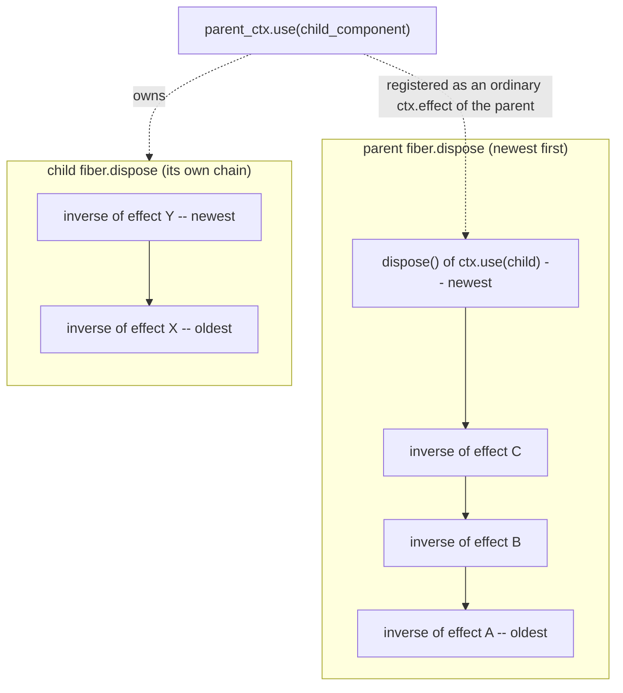
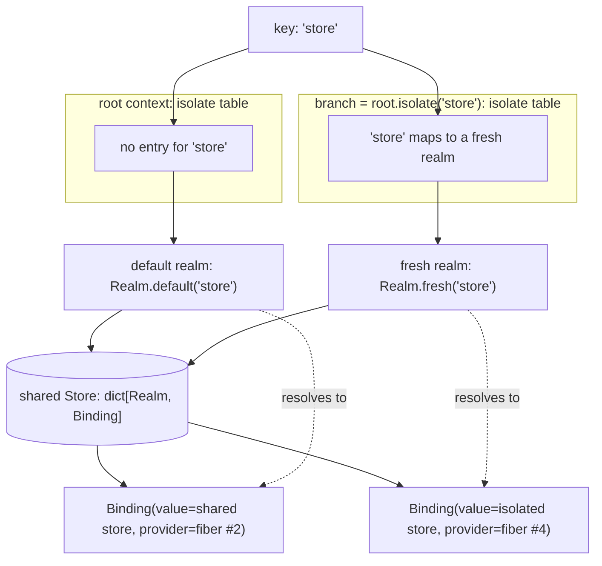
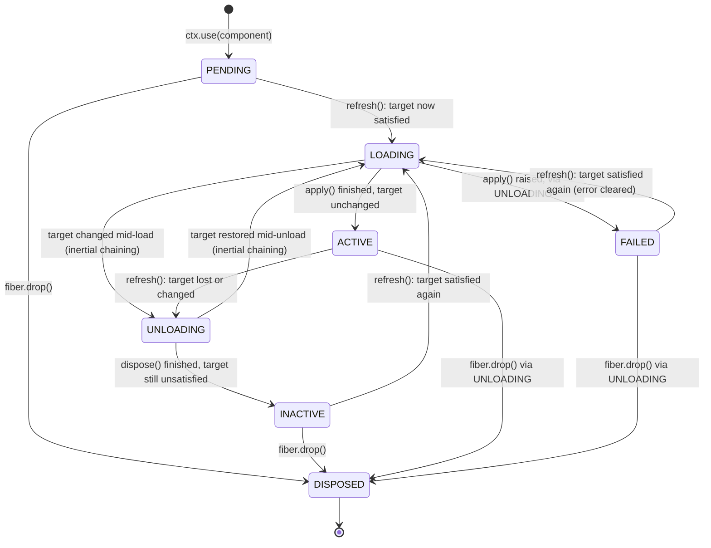
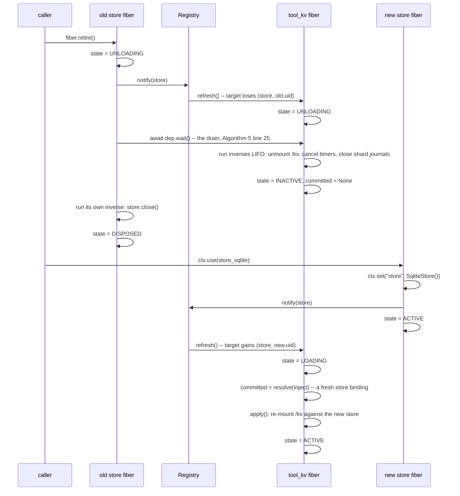

# Architecture

This document is the internals: the effect engine, the two-layer coeffect store, the fiber state
machine and its inertial chaining, and a provider hot-swap traced end to end. `docs/paradigm.md`
explains *what* effects and coeffects mean; this document explains *how* `cordispy` implements them.
Section and algorithm numbers refer to *A Programming Paradigm for Spatiotemporal Composability*
([github.com/cordiverse/paper](https://github.com/cordiverse/paper)).

## The effect engine

`cordispy.effect.execute` is Algorithm 1 directly: it drives a callback (or, in the general case, an
iterator) one step at a time, checking a guard before every step and folding each yielded inverse into
an accumulator that runs last-yielded-first. The accumulator itself is `DisposerChain`
(`src/cordispy/effect.py`), modelled as a Python list rather than nested closures, so that recovering ten
thousand accumulated effects costs ten thousand list iterations rather than ten thousand stack frames.

Two properties of `DisposerChain` are worth stating because the reference TypeScript implementation
gets both wrong (see `docs/source-review.md` for the file:line and the fix):

- Every accumulated inverse runs, even if an earlier one raises. Failures are collected and re-raised
  together as one `ExceptionGroup` once every inverse has had its turn -- one broken inverse must never
  cause every inverse after it to leak.
- Inverses run **strictly sequentially**, one fully awaited before the next starts. `dispose_2 . dispose_1`
  in the paper's composition means dispose 2 runs to completion, *then* dispose 1 starts; running both
  concurrently only guarantees they *start* in order, which is not the same claim.

One consequence of draining the list *before* running it is that an inverse which performs an effect of
its own -- releasing a resource by acquiring a temporary one, say -- prepends onto a chain the current
pass has already emptied. A single call would therefore end the unload with that inverse still queued on
the fiber, to fire one whole cycle late during the *next* unload. `Fiber._unload` re-drains until the
chain is genuinely empty, bounded by `cordispy.fiber.UNLOAD_DRAIN_PASSES`; a recovery still generating new
effects after that many passes is not converging, and is reported as a warning naming the component
rather than looped on forever.

### LIFO accumulation, and a child's disposer inside its parent's

Every fiber owns one `DisposerChain`. Look at what this diagram shows: a parent fiber's accumulator
after three plain effects and one child component, and the child's own, separate accumulator alongside
it.

What to take from it: `ctx.use` (Algorithm 4) is implemented as nothing but another `ctx.effect` call on
the parent -- its callback instantiates the fiber, and its inverse is `fiber.drop`, which unloads the
child and everything the child itself accumulated. That is the whole mechanism behind "unloading a
parent cascades to its children": there is no separate cascade step, only the same LIFO recovery
running one level up. A child's accumulator is never touched directly by the parent's recovery; the
parent's recovery calls the child's `dispose`, and the child's own chain runs its own inverses in its
own LIFO order first.

### Interrupting an iterator effect at a step boundary

Algorithm 1's guard is checked *before* every step, never in the middle of one, which is what makes an
interruption safe: only the inverses collected up to the last completed step are ever in the
accumulator. `cordispy` drives synchronous and asynchronous generator effects through `_drive_sync_generator`
/ `_drive_async_generator` (`src/cordispy/effect.py`), and both close the generator in a `finally` once
the guard trips or the generator is exhausted -- so a `try: ... finally: cleanup()` written inside a
generator effect always runs its `finally`, even on an interrupted run. The reference implementation
does not close an interrupted generator (`fiber.ts:263`; see `docs/source-review.md`, divergence 1),
which both loses that guarantee and triggers Python's own "coroutine ignored GeneratorExit" warning if
reproduced literally.

### Task ownership

An asynchronous effect is driven by an `asyncio.Task`, created through `cordispy.effect.spawn`. `asyncio`
holds only a *weak* reference to a task, so a fire-and-forget task can be garbage-collected mid-flight;
`spawn` keeps every task it creates in a module-level owning set until it settles, and consumes its
exception through a done-callback so a failure reaches the logger instead of surfacing as "Task
exception was never retrieved" at collection time.

## Two-layer coeffect resolution

`ctx.get(key)` never touches the store at `key` directly. It is a two-step lookup: `key` is mapped
through the context's isolation table to a *realm* (an opaque, identity-compared object, `Realm` in
`src/cordispy/realm.py`), and only the realm indexes the shared store. Look at the two branches below: the
root context has no isolation entry for `store` and resolves it to the key's own default realm; a
context derived with `ctx.isolate("store")` resolves the same key name to a realm nobody else can name,
so the two contexts hold **independent bindings** under what looks, from component code, like the same
key.

What to take from it: isolation is *derived realization* (paper section 5.1.2) rather than a mutation --
`ctx.isolate` returns a brand new child `Context` with one entry changed in its isolation table, and the
parent context is never written to. Recovering from an isolation call is therefore just discarding the
child context; there is no inverse to run because nothing shared was ever touched. `ctx.intercept`
works the same way, one layer further out: it attaches read-time metadata to a key without changing
which realm the key resolves to, so revising it never triggers a reload (this is exactly what the
loader's `intercept` field updates in place -- see `docs/plugin-authoring.md` and the loader section of
`README.md`).

`Binding` (`src/cordispy/realm.py`) records the **provider fiber**, not just the value, and that detail is
load-bearing: a fiber's `target` -- the digest `notify` and `refresh` compare against -- is a tuple of
`(key, provider_uid)` pairs, identified by the provider's `uid` rather than by the bound value. A `uid`
is drawn fresh and never reused, so a replacement provider publishing an *equal* value is still a
different provider as far as `target` is concerned, and every dependent correctly reloads. A provider
that overwrites its own binding in place, rather than withdrawing and reinstalling it, is therefore not
observed by its dependents -- `ctx.set` on an already-provided key withdraws the old binding and installs
the new one afresh specifically so this notification fires (see `docs/source-review.md`, divergence 5,
for the reference implementation's opposite choice).

## The fiber state machine

A fiber is the instantiation of one component in one context (paper section 5.1.3, Algorithms 4 and 5).
Read the diagram as: solid transitions are what a normal load/unload cycle looks like, and the two
labelled "inertial chaining" are what happens when a fiber's target changes *while a transition is
already running* -- the transition in flight is never interrupted; it runs to completion and its own
tail decides whether to chain into the opposite transition.

What to take from it: **inertia** is the property that a fiber's own transition is never cancelled out
from under it. `refresh()` (`src/cordispy/fiber.py`) always recomputes the target first; if a transition
is already in flight it only updates `self.target` and returns -- the running `_reload` or `_unload`
coroutine will see the new value at its own tail and decide there whether to chain into the opposite
transition. This is what makes a target that flips twice while a reload is mid-flight settle correctly
at whatever the *final* target actually is, without ever running two transitions concurrently on one
fiber.

`FAILED` deserves a note, and so does the "via UNLOADING" on the edge that reaches it. A failing
`apply` does not settle the fiber where it stood: `_reload` records the error, forces `target` to
`None`, and the tail then finds the target changed and chains into an unload exactly as any other
target change would. The inverses accumulated before the failure run there, and `_settled_state()`
resolves to `FAILED` at the end of it. That is why a half-applied component leaves nothing behind.

The other half of the note is recovery: the reference implementation clears a fiber's recorded error
only inside a separate `update()` method, so a fiber that failed once reports `FAILED` forever, even
after a later reload succeeds (`docs/source-review.md`, divergence 3). This port clears `self.error` at
the start of every reload attempt, which is why the diagram shows `FAILED --> LOADING` as an ordinary
consequence of a dependency arriving late, not a dead end.

`fiber.drop()` -- the inverse `ctx.use` returns -- clears `uid` *before* it does anything else. Because
`_settled_state()` checks `uid is None` first, any transition that completes after `drop()` was called
settles straight into `DISPOSED` rather than passing through `INACTIVE`; the diagram's "via UNLOADING"
labels record that a `DISPOSED` fiber that was `ACTIVE` or `FAILED` still runs its accumulated inverses
on the way out -- dropping a fiber is not a way to skip recovery, only a way to make recovery final.

## Provider hot-swap, traced end to end

This sequence diagram is `examples/run_hotswap.py` and `Harness.swap_store` (`examples/harness/app.py`)
made explicit: retiring the old `store` provider and composing the new one in, with nothing else
written by the caller. Read top to bottom; the two calls from the application (`fiber.retire()` and
`ctx.use(...)`) are the only lines a component author writes.

What to take from it: `tool_kv` is never told the provider changed. It reacts to its own `target`
changing, twice -- once when `store` disappears (Algorithm 5's `UNLOADING`, draining before the old
provider's own inverse closes the connection) and once when a new `store` binding satisfies it again
(`LOADING`, with a fresh `resolve(inject)` committed before `apply` runs). The old connection is closed
only *after* `tool_kv` has finished unloading, and `tool_kv` never runs against a stale binding at any
point, because its committed view is discarded only after every one of its own inverses has run. This
is Theorem 63's ordering guarantee, made concrete: `docs/paradigm.md` states the guarantee;
`tests/test_fiber_lifecycle.py::test_dependency_is_readable_during_the_dependents_teardown` is the test
that pins it down.

## The registry and batched notification

`Registry` (`src/cordispy/registry.py`) keeps every live fiber and a reverse index from coeffect key to the
fibers that declare it. `notify(ctx, keys)` looks up the union of dependents across every changed key in
one pass and re-evaluates each at most once (a fiber that declares two of the changed keys is still
`refresh()`ed only once). The reference implementation instead performs a full sweep of every fiber in
every runtime, once per changed key (`docs/source-review.md`, divergence 7); the reverse index and the
batched call are what turn that sweep into a lookup.

A fiber is only "affected" by a change at a key if its own context resolves that key to the realm the
changed binding actually **sits in** -- this is the realm test from the two-layer resolution above,
applied as the filter inside `notify`, and the paper states it as "a dependent sees the binding while
its own realm at k is the realm the binding sits in" (section 5.2.1).

That realm is a property of the binding, not of whoever is notifying, and the two part company as soon
as a provider publishes through a derived context: `ctx.isolate(k, realm).set(k, value)` installs into
`realm`, while the provider's own context still resolves `k` to the default one. So each item of the
batch may be a `(key, realm)` pair naming the realm outright, and that is what a fiber-level
notification passes (`Fiber.installed()`, which reads the realm straight off the store). A bare key
falls back to `ctx.realm_of(key)`, which is exact for `ctx.set` -- there the notifying context *is* the
context that installed the binding.

Isolation reassignment (paper Algorithm 7, realized by the loader's `Entry._reassign_realms`) needs a
different filter -- the set of fibers whose realm for the key is *about to* change -- so `notify` also
accepts an optional predicate that replaces the realm test entirely for that one call.

## Cycle detection

A dependency cycle -- component A requires what B provides and B requires what A provides -- leaves
every component in it permanently `PENDING`: each is waiting for a provider that is itself waiting.
Unlike a deadlock this is predictable from the `inject`/`provide` declarations alone with nothing
instantiated yet (paper section 6.5), so `Registry.find_cycles()` walks the declared provider graph and
`warn_on_cycles` logs a warning naming every component in a cycle a newly composed fiber joins. A
self-edge counts: a component that injects a key it also provides is a cycle of length one, waiting for
a binding only its own activation could install, and it is the shape most easily written by accident.
This is diagnostic, not preventive: the runtime does not refuse to compose a cyclic set of components, because
refusing would require rejecting a configuration on the basis of declarations that a later `ctx.set`
call is free to falsify (a component may declare `provide` without a matching key ever being
installed). It simply gives a name to what would otherwise present as several components silently stuck
at `PENDING` forever.
