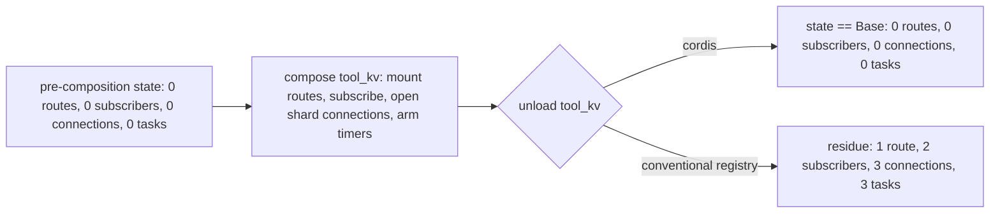

# What the paradigm buys, measured

This document is the output of `examples/run_benefit.py`, not a description of it. The same
application is built twice -- once on `cordispy` (`examples/harness/`), once on a conventional plugin
registry (`examples/naive/`) -- and four scenarios ask the same question of both: *when a component goes
away, or its dependency changes, does the process return to the state it was in before?* Every number
below is read out of the live process at the moment it is printed; see "Methodology" for exactly how.

## Reproduce it

```sh
uv run python examples/run_benefit.py --scenario all
```

`--scenario` also accepts `residue`, `hotswap`, `late` or `failure` individually; `--verbose` narrates
each step as it runs; `--log-level` controls how loudly both runtimes report the failure the `failure`
scenario provokes on purpose (default `critical`, which keeps that expected report out of the table).

## The conventional side is not a straw man

`examples/naive/` implements the identical application against a design almost every plugin system in
wide use converges on: a process-wide service dictionary, `register()` running a plugin's `setup`,
`unregister()` running its `teardown`, and an expectation that each plugin cleans up after itself. Every
file in it opens with the same statement, because it is the honesty condition the whole comparison rests
on:

> THIS IS A FAITHFUL CONVENTIONAL IMPLEMENTATION, NOT A STRAW MAN.

No cleanup call is missing and no bug is planted. `examples/naive/plugins.py` imports the *same* leaf
services `examples/harness/plugins.py` does -- the same `Server`, the same `MemoryStore`/`SqliteStore`,
the same tracked sqlite connection factory -- so both applications do identical work; only the
composition mechanism differs. The design decision that makes the comparison honest is `tool_kv`, built
identically on both sides: it opens a sqlite journal connection per key shard and arms a deferred
compaction timer *while serving a request*, not while loading. In `cordispy` those are ordinary
effects, on the fiber's accumulator the instant they exist. In the naive version they happen inside a
request handler, which runs after `setup()` returned and therefore after the one place `teardown()`'s
author could have written them down.

## Methodology

Nothing in the table below is hard-coded:

- **Pending tasks** are `frozenset(asyncio.all_tasks())` set differences, so the currently-running task
  and anything that merely happens to exist on both sides of a comparison cancel out.
- **Open sqlite connections** are counted by asking each tracked connection to run `select 1`; a closed
  connection raises `sqlite3.ProgrammingError`, so the count is of connections that are genuinely still
  open, not of bookkeeping entries.
- **Routes and subscribers** are `len(server.routes)` and `bus.subscribers()` read from the real
  dispatcher and bus objects, not from a model of them.
- **Residue** is always the difference between two snapshots taken immediately around the thing being
  measured (`examples/harness/probe.py:compare`), never an absolute count -- the question is what a
  component left behind, not how large the application is.

The demo also doubles as an assertion: it checks 22 cordis-side invariants and exits non-zero if any of
them does not hold (verified in `tests/test_benefit.py` by feeding `report()` a deliberately failing
result).

## The four scenarios

1. **Residue after unload.** Compose `tool_kv`, exercise it against a real workload, retire it, and
   count what is left: route handlers, event subscribers, open sqlite connections, pending tasks.
2. **Provider hot-swap.** Replace the `store` provider under a running `tool_kv` and check whether it
   keeps serving requests, against which backend, and whether the old connection was released.
3. **Late dependency arrival.** Compose `tool_kv` *before* anything provides `store`, then compose the
   provider afterward, and check whether the consumer ever becomes usable. The same scenario also
   imports a plugin module on each side while nothing provides `store`: `examples/harness/lazy.py`,
   which only *declares* the key, against `examples/naive/eager.py`, which resolves it at module scope.
   Both imports are performed for real, and the row reports what each one did.
4. **Failure containment.** Load a component that mounts a route and then raises, and check what state
   it settles in and whether its half-applied route survives.

## The result

Literal output of `uv run python examples/run_benefit.py --scenario all`, exit code `0`:

```text
+----------+---------------------------------------------+----------------------------------------------+------------------------------------------------+
| scenario | measurement                                 | cordis                                       | conventional registry                          |
+----------+---------------------------------------------+----------------------------------------------+------------------------------------------------+
| residue  | resources the component acquired            | 13                                           | 13                                             |
|          | leftover route handlers                     | 0                                            | 1                                              |
|          | leftover event subscribers                  | 0                                            | 2                                              |
|          | still-open sqlite connections               | 0                                            | 3                                              |
|          | still-pending asyncio tasks                 | 0                                            | 3                                              |
|          | total residue                               | 0                                            | 9                                              |
+----------+---------------------------------------------+----------------------------------------------+------------------------------------------------+
| hotswap  | provider the runtime reports after the swap | sqlite                                       | sqlite                                         |
|          | consumer state after the swap               | ACTIVE                                       | REGISTERED                                     |
|          | previous provider released                  | yes                                          | yes                                            |
|          | write served after the swap                 | ok                                           | StoreClosedError: the memory store has been... |
|          | backend that served it                      | sqlite                                       | unreachable                                    |
|          | value read back after the swap              | 2                                            | None                                           |
+----------+---------------------------------------------+----------------------------------------------+------------------------------------------------+
| late     | consumer state with no provider             | PENDING                                      | MissingDependencyError: no service register... |
|          | rest of the application still serves        | ok                                           | ok                                             |
|          | request before the provider arrives         | RouteError: no route mounted at '/kv/put'    | RouteError: no route mounted at '/kv/put'      |
|          | importing a plugin module with no provider  | ok                                           | KeyError: 'store'                              |
|          | consumer state once the provider arrives    | ACTIVE                                       | ABSENT                                         |
|          | request after the provider arrives          | ok                                           | RouteError: no route mounted at '/kv/put'      |
+----------+---------------------------------------------+----------------------------------------------+------------------------------------------------+
| failure  | state recorded for the failed component     | FAILED                                       | ABSENT                                         |
|          | error recorded                              | RuntimeError                                 | RuntimeError                                   |
|          | routes the failed component left behind     | 0                                            | 2                                              |
|          | total residue from the failure              | 0                                            | 2                                              |
|          | its half-mounted route still answers        | RouteError: no route mounted at '/broken/go' | ok                                             |
|          | the rest of the application still serves    | ok                                           | ok                                             |
+----------+---------------------------------------------+----------------------------------------------+------------------------------------------------+

verdicts
  residue: cordis leaves nothing; the conventional registry leaves 1 route handler, 2 event subscribers, 3 sqlite connections, 3 pending tasks
  hotswap: cordis reloads the consumer against the new binding and keeps serving; the conventional registry leaves it holding the old provider (StoreClosedError: the memory store has been closed by its provider)
  late: cordis holds the consumer PENDING and activates it when the provider appears; the conventional registry fails at registration and never retries
  failure: cordis rolls back the inverses accumulated before the failure and records FAILED; the conventional registry logs the error and leaves 2 route(s) mounted

cordis-side invariants (this demo doubles as an assertion)
  [PASS] residue: the component actually acquired resources
  [PASS] residue: no route handler survives the unload
  [PASS] residue: no event subscriber survives the unload
  [PASS] residue: no sqlite connection survives the unload
  [PASS] residue: no asyncio task survives the unload
  [PASS] hotswap: the new provider is bound
  [PASS] hotswap: the consumer is active again
  [PASS] hotswap: the previous provider was released
  [PASS] hotswap: requests are served after the swap
  [PASS] hotswap: the new provider serves them
  [PASS] hotswap: data written after the swap reads back
  [PASS] late: the consumer waits instead of failing
  [PASS] late: the rest of the application is unaffected
  [PASS] late: importing the consumer module needs no provider
  [PASS] late: the consumer activates by itself
  [PASS] late: it then serves requests
  [PASS] failure: the failure is recorded on the component
  [PASS] failure: the error is retained
  [PASS] failure: the routes it mounted were rolled back
  [PASS] failure: it leaves no residue at all
  [PASS] failure: its half-mounted route is gone
  [PASS] failure: the rest of the application is untouched

OK: 22 cordis-side invariants hold
```

Both sides acquire exactly 13 resources for the same workload (3 routes, 2 subscribers, 4 connections,
4 tasks) before anything is unloaded -- the "resources the component acquired" row is identical on both
sides of the residue scenario. The gap that follows is not a gap in what the code does; it is a gap in
what each design can express about taking it back.

## Residue, pictured

Look at the two outcomes of the same unload: cordis returns to the pre-composition snapshot exactly;
the conventional registry's `teardown` -- written before any request existed -- cannot mention the
resources `tool_kv` acquired while serving one.



What to take from it: the two paths through `Unload` run the same component against the same workload.
The branch is not a difference in what `tool_kv` did while it was loaded -- both sides mounted the same
routes and opened the same connections -- it is a difference in what each design can name at teardown
time. `ctx.effect` records the inverse next to the effect it undoes, wherever in the component's
lifetime that effect happens to occur; a hand-written `teardown` method can only mention what its author
put there, and nothing created after `setup()` returned was ever visible to write.
