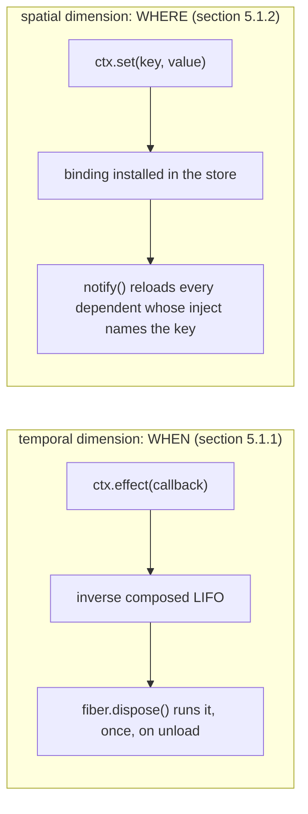

# The paradigm: effects and coeffects

This document explains the theory this runtime realizes, in the paper's own terms, and shows the
Python call that implements each piece. It assumes no prior reading of the paper. Section numbers
throughout refer to *A Programming Paradigm for Spatiotemporal Composability*
([github.com/cordiverse/paper](https://github.com/cordiverse/paper)); algorithm numbers refer to
Section 5 of it, which is what `cordispy` implements line for line.

## Spatiotemporal composability, in one sentence

A running system is *composable* along two axes if a piece of code can be added to it and removed from
it at any point in its lifetime, without restarting the process (temporal composability) and without
the code around it having to arrange, by hand, when that piece's dependencies become available
(spatial composability). Most plugin systems get neither for free: removing a plugin means restarting
the host, and depending on another plugin means writing your own polling loop or accepting an import
that might fail. This runtime gives both, by making every context mutation go through one revertible
primitive and every dependency declaration go through one reactive one.



What to take from it: the two boxes are not two separate features bolted together. `ctx.set` is itself
built on `ctx.effect` (its inverse withdraws the binding it installed), and instantiating a component
with `ctx.use` is a `ctx.effect` call too (its inverse retires the fiber). The spatial dimension is
implemented *in terms of* the temporal one -- there is exactly one thing this runtime knows how to do
to a context, and everything else reduces to it.

## The temporal dimension: revertible effects (section 5.1.1, Algorithm 1)

Every mutation a component performs -- publishing a value, mounting a route, arming a timer,
subscribing to an event, instantiating a child component -- goes through one call:

```python
dispose = ctx.effect(callback)
```

`callback` applies the mutation and hands back its inverse. `ctx.effect` is a **synchronous** call that
returns an awaitable `dispose`: a wholly synchronous callback has already run to completion by the time
`ctx.effect` returns, and needs no running event loop at all; a callback that is a coroutine or an
async generator is driven by an `asyncio.Task`, which does need one.

The paper allows both a plain effect function and an effect *iterator* through one operation --
ad-hoc polymorphism, since a plain function is the degenerate iterator that yields exactly one inverse.
`cordispy` accepts five concrete Python shapes for `callback`:

| Form | Meaning |
| --- | --- |
| `def cb() -> None` | An effect with no inverse. |
| `def cb() -> Disposer` | A single inverse. |
| `async def cb() -> Disposer \| None` | The same, asynchronously. |
| `def cb() -> Generator[Disposer, None, None]` | Iterator form: one inverse per `yield`. |
| `async def cb() -> AsyncGenerator[Disposer, None]` | The same, asynchronously. |

The iterator form is what lets a component's effect be interrupted mid-sequence and still leave the
system consistent: Algorithm 1 pulls one `(value, done)` pair per iteration and checks a *guard* before
each pull. The moment the guard reports `False`, iteration stops -- but every inverse collected up to
that point has already been folded into the composite, so only what actually happened gets undone, and
nothing half-applied is left unaccounted for. `docs/architecture.md` walks through what trips the
guard (target instability during a reload, or `dispose()` being called during an unload) and how the
runtime closes an interrupted generator so its own `finally` still runs.

Composition is last-applied-first:

```python
inverse = compose(new_disposer, previous_inverse)  # new_disposer runs FIRST
```

so unloading a component that armed three effects in order A, B, C runs their inverses C, then B, then
A -- the ordinary stack discipline, and the reason a component that opens a connection and then a
cursor over it can close the cursor before the connection without writing that order down twice.

The runtime does **not** check that an inverse actually reverses its effect. That an inverse recovers
what its effect applied is an obligation on the component author, not a property the runtime verifies
(paper section 5.1.1) -- the runtime's guarantee is entirely about *when* the inverse runs: once, in
reverse order, and at a clean step boundary rather than mid-iteration.

## The spatial dimension: coeffects (section 5.1.2, Algorithms 2, 3, 6)

A component states two things about the outside world, and only through declarations:

- **What it needs.** `inject=["store"]` (or `{"required": [...], "optional": [...]}`) on `@plugin`.
- **What it offers.** `provide=["store"]` on `@plugin`, and then, from inside `apply`, `ctx.set("store",
  value)` to actually install the binding.

Neither declaration is a lookup. `provide` only tells the runtime what a component *may* install, which
is enough to detect a dependency cycle from the declarations alone (paper section 6.5) without
instantiating anything; the binding itself is not visible to anyone until `ctx.set` runs.

### Two layers between a key and a value

A coeffect key is never looked up in the value store directly. It first passes through an isolation
table that maps the key to a *realm*, and only the realm indexes the store:

```text
key --(isolate table)--> realm --(store)--> (value, provider fiber)
```

A key with no entry in the isolation table resolves to its own default realm, so outside of any
`ctx.isolate` call a key simply is its own realm. `ctx.isolate(key)` derives a **child** context whose
isolation table redirects that one key to a fresh realm, leaving the parent's table untouched; the
child and the parent then hold independent bindings for what looks, from the component code, like the
same key. `docs/architecture.md` has the full two-layer diagram, including two sibling contexts
isolating the same key to different realms side by side.

### Reading a coeffect: three calls, three different guarantees

- `ctx.get(key)` -- a reflective read against the *store*. Returns the bound value or `None`. Never
  raises. It answers "what is bound right now", with no reference to who is asking.
- `ctx.optional(key)` -- the committed-view read below, but `None` instead of an error where the key is
  declared and unsatisfied. This is what an *optional* inject needs, and optional injects are this
  port's own extension over the paper's flat specification (`docs/limitations.md`).
- `ctx.key` (attribute access) -- Algorithm 6. Resolves against the *accessing fiber's own committed
  view*, walking the fiber-parent chain, and enforces the component's own `inject` declaration:

```text
if key in fiber.committed: return fiber.committed[key].value
if key in fiber.inject:    raise InactiveAccessError   # declared, but not currently loaded
if fiber is root:          raise UndeclaredAccessError  # never declared at all
fiber = fiber.parent.fiber
```

The difference matters because a committed view is fixed at the moment the fiber last loaded and is
only discarded *after* every one of the fiber's own inverses has run (paper Theorem 63) -- so a
component whose teardown was triggered by its dependency disappearing can still read that dependency,
by name, while releasing whatever it acquired from it. `ctx.get` cannot make that promise: it reads the
live store, which may already have moved on. Both reads are legitimate; which one a component wants
depends on whether it wants "what is true right now" or "what I loaded against."

### Reactive notification (Algorithm 3)

`ctx.set(key, value)` installs the binding and then calls `notify`, which re-evaluates every fiber that
both declares the key in its `inject` and resolves it to the realm the binding sits in -- the setter's
own realm here, and in general whichever realm the changed binding actually occupies. Re-evaluation
means recomputing the fiber's *target* -- a digest of `(key, provider uid)` pairs over its declared
keys -- and, if the digest changed, starting a reload or an unload. `notify` runs on every `ctx.set` and
every withdrawal, which is what makes a provider's arrival and a provider's departure symmetric: a
consumer composed before its provider exists simply has an unsatisfied target and does not run at all,
and it activates itself the instant `notify` reports the target became satisfied. No consumer ever
polls, and no orchestrator ever has to sequence which component loads before which -- `docs/architecture.md`
traces the machinery that makes that ordering always safe (paper Theorem 63: composing entries in any
order quiesces at the same state).

## Where this leads

Both dimensions meet at the fiber -- the instantiation of one component in one context -- which is
`docs/architecture.md`'s subject: the state machine a fiber moves through, how a reload's guard gives
partial rollback, and how a provider hot-swap looks end to end. `docs/plugin-authoring.md` picks the
practical side back up: how to write `@plugin` code that uses both dimensions correctly.
