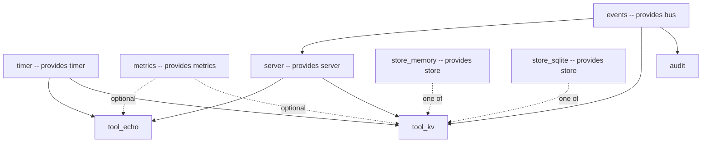

# Writing a component

A component pairs a coeffect specification with an effect function. This document is the practical
half of `docs/paradigm.md`: how to write `apply`, which callback shapes it may return, how to read and
publish coeffects correctly, and how the demo harness's own components (`examples/harness/plugins.py`)
put all of it together. Section numbers refer to *A Programming Paradigm for Spatiotemporal
Composability* ([github.com/cordiverse/paper](https://github.com/cordiverse/paper)).

## The `@plugin` decorator

```python
from cordispy import Context, plugin


@plugin(name="metrics", provide=["metrics"])
def metrics_plugin(ctx: Context, config):
    ctx.set("metrics", {})
```

`@plugin` normalizes a plain function into a `Component` (`src/cordispy/component.py`):

- `name` -- how the component is labelled in logs, diagnostics and the loader's fiber tree. Defaults to
  the function's `__name__`.
- `inject` -- what the component needs. Accepts a single string, a list of strings (all required), or
  `{"required": [...], "optional": [...]}`.
- `provide` -- what the component *may* install. A declaration only: nothing is published until the
  component actually calls `ctx.set`. Declaring `provide` is what lets a dependency cycle be detected
  from the declarations alone (paper section 6.5), before anything is instantiated.

`apply` -- the decorated function -- receives its own derived `Context` as the first argument, and the
configuration it was instantiated with as the second, *if* it declares a second parameter. A component
that takes no configuration can simply omit it:

```python
@plugin(name="audit", inject=["bus"])
def audit(ctx: Context, config): ...


@plugin(name="metrics", provide=["metrics"])
def metrics_plugin(ctx: Context, config):  # `config` is accepted but ignored
    ctx.set("metrics", {})
```

`to_component` (also in `src/cordispy/component.py`) accepts anything with a callable `apply` attribute in
place of a decorated function, which is how the loader's built-in `group` and `include` components --
built per entry, not as static functions -- participate in `ctx.use` the same way a `@plugin` does.

## Instantiating a component

```python
fiber = ctx.use(component, config)  # alias: ctx.plugin(component, config)
```

`ctx.use` is Algorithm 4: it builds a `Fiber`, derives the fiber's own child context, and registers the
whole instantiation as an ordinary effect *of the calling context's own fiber* -- so unloading a parent
fiber cascades into every fiber it instantiated, through the same LIFO recovery every other effect uses
(see `docs/architecture.md`'s LIFO diagram). The returned `Fiber` is a handle:

- `await fiber.wait()` -- wait for that one fiber's current transition to settle.
- `await root.registry.settle()` -- wait for *every* fiber in the runtime to reach a fixed point. Prefer
  this over `fiber.wait()` when composing several components at once: a fiber whose provider is still
  loading has nothing in flight yet, so `wait()` on it returns immediately and proves nothing.
- `await fiber.retire()` -- the inverse of `ctx.use`. Unloads the fiber and drops it from the runtime
  for good.
- `fiber.state`, `fiber.target`, `fiber.error` -- inspection. See `docs/architecture.md` for the state
  machine and what each field means.

## The five effect-callback forms

Every mutation inside `apply` -- publishing a value, mounting a route, arming a timer -- should go
through `ctx.effect(callback)` rather than being written directly, because `ctx.effect` is what makes it
recoverable. `cordispy` accepts five shapes for `callback` (paper section 5.1.1, Algorithm 1):

| Form | Meaning |
| --- | --- |
| `def cb() -> None` | An effect with no inverse. |
| `def cb() -> Disposer` | A single inverse. |
| `async def cb() -> Disposer \| None` | The same, asynchronously. |
| `def cb() -> Generator[Disposer, None, None]` | Iterator form: one inverse per `yield`. |
| `async def cb() -> AsyncGenerator[Disposer, None]` | The same, asynchronously. |

The simplest and most common form is a plain function returning its own inverse, and `apply` itself may
use exactly this shape -- a component's own `apply` is driven by the same engine as `ctx.effect`, with
the fiber's target-stability check standing in for the `armed` guard:

```python
@plugin(name="store_memory", provide=["store"])
def store_memory(ctx: Context, config):
    store = MemoryStore()
    ctx.set("store", store)
    return store.close  # apply's own return value is apply's own inverse
```

The generator form is for a component that needs to register something *before* it creates any children
or does anything that can fail, and wants that registration's own inverse to run first if a later step
raises -- the loader's `group` component does exactly this (`src/cordispy/loader/group.py`):

```python
async def apply(ctx: Context, config):
    group = EntryGroup(ctx, entry.tree, owner=entry)
    entry.subgroup = group
    yield group.stop  # this inverse is accumulated before any child exists
    await group.reconcile(config)  # if this raises, group.stop still runs
```

## Publishing a coeffect: `ctx.set`

```python
ctx.set("store", MemoryStore())
```

`ctx.set` is itself a `ctx.effect` call: its callback installs the binding and notifies dependents, and
its inverse withdraws the binding and notifies again. Re-setting a key the same fiber already provides
withdraws the old binding first and installs the new one afresh -- which is what makes the replacement
visible to dependents at all (`docs/source-review.md`, divergence 5). Setting a key a *different* fiber
already provides raises `UndeclaredAccessError`; two fibers cannot provide the same key in the same
realm at once.

A provider does **not** read its own binding back as `ctx.key`. A committed view is `resolve(inject)`
and nothing else, so property access keeps enforcing the component's own declarations even for the
component that just published the value. Read a value the component just set from a local, or with
`ctx.get`:

```python
@plugin(name="server", inject=["bus"], provide=["server"])
def server_plugin(ctx: Context, config):
    ctx.set("server", Server(bus=ctx.bus))  # `bus` is injected, so `ctx.bus` is fine here
```

## Reading a coeffect: `ctx.key`, `ctx.optional` and `ctx.get`

Three different calls, three different guarantees (paper section 5.1.4, Algorithm 6):

```python
ctx.store  # Algorithm 6: the fiber's own committed view. Raises if unsatisfied.
ctx.optional("metrics")  # the same view, but None where the declared key is unsatisfied.
ctx.get("store")  # a store lookup. Returns the value or None. Never raises.
```

`ctx.key` is for a component reading its own **declared** dependency -- it enforces `inject`, and it
reads the same snapshot the component activated against, which is what keeps a dependency readable
during the component's own teardown even after the provider has started unloading (paper Theorem 63;
traced end to end in `docs/architecture.md`'s hot-swap diagram). It raises two different errors, both
subclasses of `AccessError`:

```python
try:
    ctx.missing  # never declared in this component's `inject`
except UndeclaredAccessError:
    ...

try:
    ctx.declared  # declared, but the declaring fiber is not currently loaded
except InactiveAccessError:
    ...
```

`ctx.get(key)` is for everything else: inspecting state from outside any fiber, a provider reading back
the value it just published, or a diagnostic tool that has no `inject` of its own to enforce.

### Optional dependencies: `ctx.optional(key)`

A key in `inject`'s `optional` list never gates activation, so a perfectly `ACTIVE` component can
declare one that nothing provides. `ctx.key` cannot express that: a declared key with no committed
binding is the `INACTIVE_ACCESS` case of Algorithm 6, so property access raises rather than answering
`None`. `ctx.optional(key)` is the reader for exactly this case:

```python
@plugin(name="tool_echo", inject={"required": ["server"], "optional": ["metrics"]})
def tool_echo(ctx: Context, config):
    def say(payload):
        counter = ctx.optional("metrics")  # None when nothing provides `metrics`
        if counter is not None:
            counter.incr("echo.say")
        return {"echo": payload}
```

It resolves against the accessing fiber's committed view exactly as `ctx.key` does, walking up the
fiber chain the same way, and differs in one point only: a **declared** key with no committed binding
gives `None` instead of raising `InactiveAccessError`. Two consequences are worth stating:

- it is still a *checked* accessor. A key the fiber never declared raises `UndeclaredAccessError`, just
  as `ctx.key` does. `ctx.optional` is not a way to read something the component never declared;
- it is still the **committed view**, not the store. `ctx.get(key)` is wrong here in the other
  direction: it can answer with a value whose provider has already started unloading, or with a value
  from a different provider than the one this fiber activated against. `ctx.optional` returns exactly
  what this fiber's own activation resolved.

`ctx.key` says so itself when it refuses an optional key: the `InactiveAccessError` it raises names
`ctx.optional(...)` as the call that can answer, and reads differently from the message for a
*required* key, whose fiber simply is not loaded.

`examples/harness/plugins.py` uses it in `tool_echo`, `tool_kv` and the shared heartbeat helper --
the three optional reads in the demo application.

## The built-in `timer` and `bus` plugins

`cordispy.plugins` ships two components that exist to be unloaded cleanly, and every method on both is a
thin wrapper over `ctx.effect`, so what they arm belongs to whichever fiber called them:

```python
from cordispy import Context, plugin
from cordispy.plugins import events_plugin, timer_plugin


@plugin(name="poller", inject=["timer", "bus"])
def poller(ctx: Context, config):
    ctx.timer.interval(ctx, 60.0, lambda: ctx.bus.emit("tick"))
    ctx.bus.on(ctx, "tick", lambda: print("ticked"))
```

- `Timer.timeout(ctx, delay, fn)` / `Timer.interval(ctx, period, fn)` -- arm a one-shot or repeating
  timer. The inverse both cancels the task **and awaits it**, because `Task.cancel()` only requests
  cancellation; without the await, the task is still in `asyncio.all_tasks()` at the moment a caller
  measures "zero pending tasks after unload."
- `Bus.on(ctx, event, handler)` -- subscribe, tracked. `Bus.subscribe(event, handler)` is the raw,
  unmanaged form (its removal function is the caller's own responsibility), which exists so a
  conventional implementation can be written against the *same* bus for comparison -- see
  `docs/benefits.md`.

Because Python has no equivalent of the reference implementation's receiver-rebinding Proxy, both take
the component's own `ctx` as an explicit first argument rather than resolving it implicitly
(`docs/limitations.md` explains why that machinery is out of scope). An effect armed from inside a
request handler, long after the component loaded, is owned exactly as completely as one armed at load
time -- `tool_kv`'s deferred-compaction timer below is armed per request and still recovered by the
component's ordinary unload.

## Nested composition

A component may itself call `ctx.use` on its own derived context. Because that call is registered as an
effect of the calling fiber, the child's whole subtree unloads automatically when the parent does --
there is nothing else to write. `Entry.rebuild` in the loader relies on exactly this to retire a
group's children when the group itself is rebuilt (`src/cordispy/loader/entry.py`).

## The demo harness's dependency topology

`examples/harness/` is a small agent harness where every feature is a component (paper section 1.2.2,
and the production system built on this design,
[deepseek-ai/deepseek-harness](https://github.com/deepseek-ai/deepseek-harness)). Read the diagram as a
provider/consumer graph: an arrow from a provider to a consumer is a required `inject`; the dashed
arrows mark an optional dependency and the two interchangeable providers of `store`.



What to take from it: `tool_kv` has the widest dependency footprint in the demo -- four required
coeffects and one optional one -- and is deliberately the component the whole benefit demo exercises,
because it is also the one whose resources are least visible to a hand-written `teardown`. It opens a
sqlite journal connection per key shard and arms a deferred compaction timer *while serving a request*,
long after the component's own `apply` returned; both are ordinary `ctx.effect` calls, so both are on
the fiber's accumulator the moment they exist, and both are recovered by the same unload that recovers
everything the component did at load time. `docs/benefits.md` measures exactly what that buys against
the conventional registry built on the same leaf services.

Only `server`, `store_memory`/`store_sqlite`, `events` and `timer` declare `provide`; `metrics` also
provides a key but nothing requires it -- it is optional everywhere, which is why it shows up only as a
dashed edge above.
